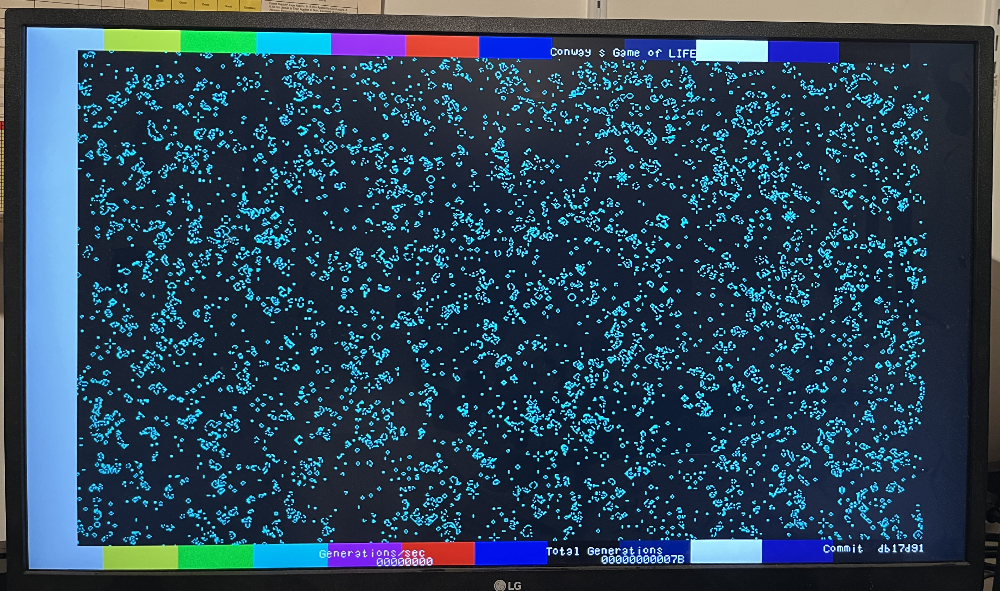
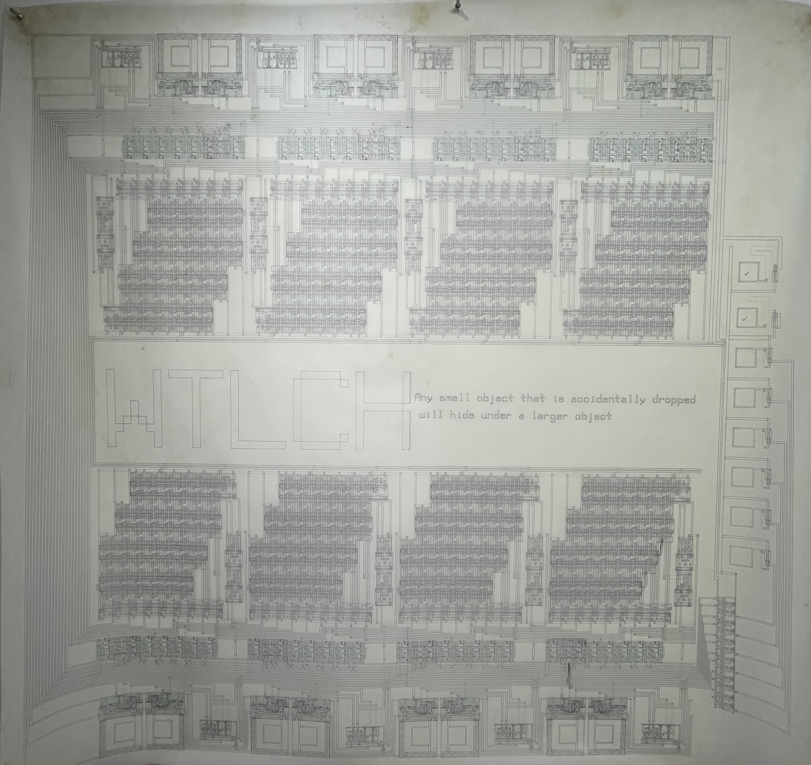
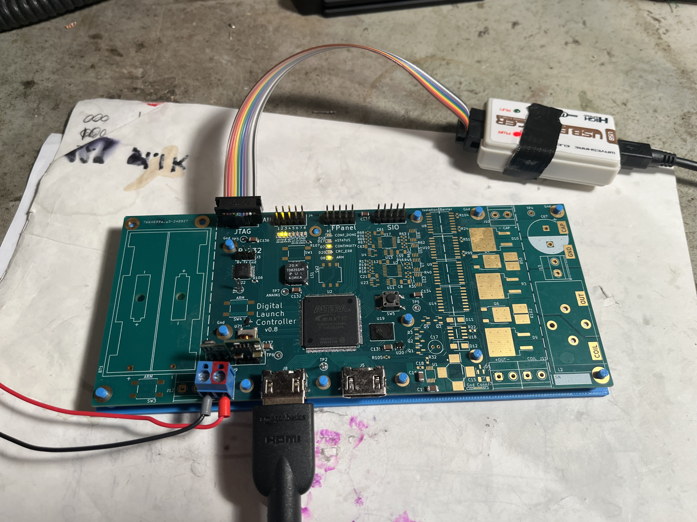
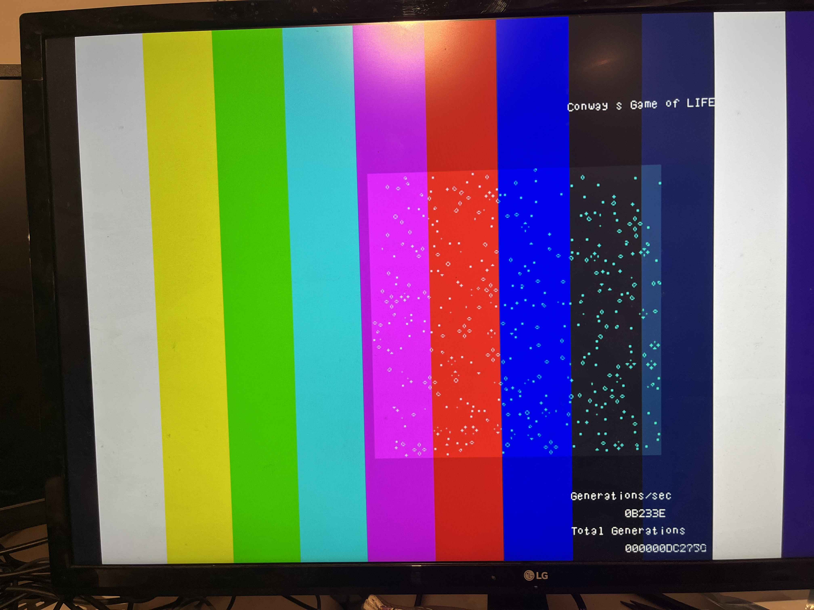
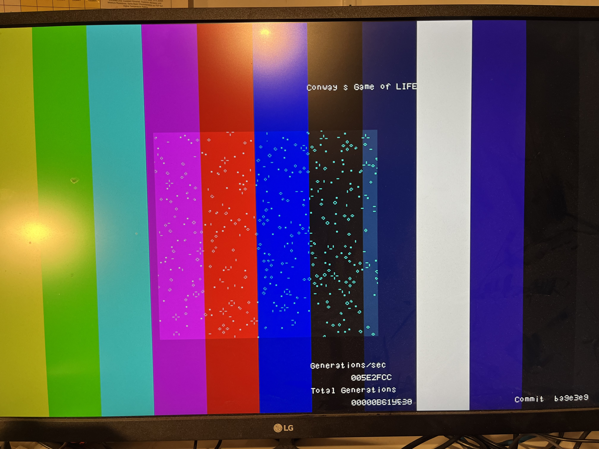
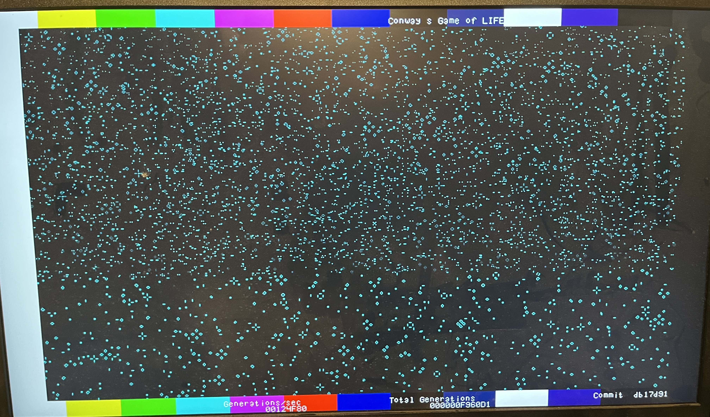

# fpga_life
A FPGA implementation of Conways's game of life. 

Game of life at 1.2 million generations per second (720x440)

## Background

(insert pic link to life glider gif)

Life in this case is a cellular automata game played on a grid of cells, where each cell is alive (1) or dead (0). The cellular automata rules are applied to all grid cells simultaneously to determine each cells next state, 1 or 0 from its state and the number of live neighours (0 to 8). The rules are: i) If a dead cell has 3 live neighbors it will be born and live. ii) if a live cell has 2 or 3 live neighbours it will continue to live. iii) Otherwise the cell remains dead or dies. 
Start with any arragement of cells on the grid. Itteratively applying the life rules to the grid cells simultaneously each time advancing 1 generation of life. 
If all cells die you loose the game of life.

(insert bibliography on Game of Life reference )

I found conway's life as a kid and was always interested in the active patterns people had discovered. The patterns have been shown remarkable capable, ie: like simulating a computer as patterns.
I've implemented life in many ways in software over the years, as a fun excersize.
During a graduate vlsi design course I was able to propose, and see through a group project to implement a vlsi chip to implement life. 
I think I might still have the actual chips in a drawer somewhere (plot shown below). I'd have to look up the technical paper, 
but think it was 1000 generations per second for a similar gid size using 32 of these chips.

Over my career I've improved the releavant design techniques. I thought I would revisit Life, you know, for fun.

Implementing that old chip in system Verilog turned out nicely. Formerly a large pcb with 32 chips and memories for a 256x256 array, it now all fits in a $20 FPGA chip with 1000x the performance too.

The FPGA is adept at DVI or HDMI video output, and can compactly be used to display the life cell array in a window beside live statistics.

## Platform

My previously designed fpga board and its code for HDMI/DVI output made a solid starting platform for this project.

The fpga 10M04 was chosen as a low cost and the development software was free. 
The software (Quartus) is very very good at producing high density, high performance implementations of 
of my verilog described designs. Once compiled, the hardware design can be programmed into flash memory inside the fpga.
When power is applied the design is loaded instantly (10msec) and begins operating at 100's of Mhz frequencies.

A 2nd fpag board was built partially populated, with just the system resources and HDMI connectors. In that case the largest
10M25 was used to test the cross compatibility between the 2 different sizes. Although initially things fit on both fpga's, the 10M04 is 97% utilized 
so anticipate only using the 10M25 as features are added. I should also be able to extend array size and increase performance.

## Implementation

Re-using the platform code for clocking, wvga hdmi/dvi video and text overlay allows focus on the core algorithm implementation.

The code is implemented in system verilog.

I implemented a 1r1w 256bit 256word memory using 8 memory blocks (M9K's). Each word of the memory is 1 row of the cell array.
The data path needed to support both the read write to maintain 1 row/cycle rate, but also needed to support initialization writes and video row reads.

HDMI video output is accomplisehd by making a single read of a full row on each active scanline of the video output row, and shifted the read data out during that that video row. 

")

## Performance

Here's a picture of the display showing over 700K generations per second and lots of room for increased performance.

(hex b233e = 729,918 generations/sec)

Would love to work on and even 1000x faster version some day.....

Eric

## V2 Update 6.1 Mhz: 
10x performace by replicating the row (256x1) Life cell array as 10 row generations of 256x1. This design now utilizes 94% of the fpga.
Also completed the torus top bottom wrapping by advancing the buffer pointer 10 rows after each pass.
The performance is now 6,172,620 (5e2fcc) generations per second, a measured 8.45x perf improvement.

Can I get much more performance from this fpga? 
I do feel I'm walking a well worn path of conway's life hardware enthusiests.
I'm going to examine some 2D array arrangements to see if I can increase the life cells fitting the fpga chip.
A 2D life array implementation would be ideal for extension to larger (10Kx10K) cell arrays, but would have
a bit more complexity in the overlaps. Alternatively a multi-row implementation say 256x8 would run in the current
framework. Hmm...

## V3 Update 6.6 Mhz: 
The current life cell is based upon adding 3 columns of 3 cells and then re-using these partial sums each 3 times. The 3 partial sums of 2 bits are then summed for each cell. This gives 13 LE/cell, but with the sharing of partial sums it becomes 9 LE/cell on average.
Looking at other arrangements a |==| arangement gives 9 LE/cell, and with sharing will average 7.3 LE/cell. However this assumed the final adder would fit in 3 LE. However the tool kept using 4 cells. This forced a deep dive and actual cells instantiation with WYSIWYG primatives with the unlikely name of fiftyfivenm_lcell_comb() where the actuall cell luts and carry chain configuration are manually provided. Using this means I was able to pack 5 of this adders in a 16-LE LAB. This gave me a theoretical 7.5 LE/cell. When compiled I was able to get 11 rows compiled into the FPGA (vs 10). This utilized 100% of the fpga. Running the measurements gave about 6.6 Million operations. About 8% peformance improvement for *alot* of effort.

I do plan on looking at extension to a slightly larger array (say 1Kx256) keeping the same array, as once this is mastered any size of array could be used. It would force addressing overlaps and video a bit differently. Hmm.. 

## V4 Update 1.2 Mhz on 720x440 array: 
This is the penultimate form of life fitting in this FPGA that I can achieve. Implementing a 45x44 compute array using 1980-bit memory busses
I am able to fill my display size and use every single memory resource in the FPGA. The speed may be a little bit slower, but
without any image width restrictions it is supperior. 

WIth hex 124F80 = 1,200,000 generations per second on 720x440 equal to about 5.8 for a 256x256 array it is a slowdown, but given its 100% efficient in compute cycles, image size flexibility it is a step forward. As part of this I fully parameterized the life computer engine over width, depth and generations and searched for the result that would take best advantage of the fpga resources while place/routing and closing timing in the 10M25 fpga I had.

Photo of the performance of the V4 release

