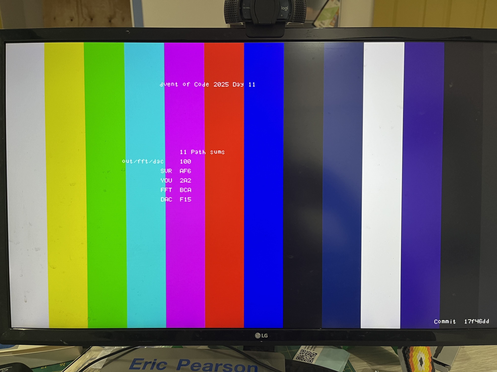

# AOC Day 11 Part 1 

Implemented in a MAX10 fpga. Solution time in 164.2ns. This example showcases the fpgas, parallel computation, low latency and re-configuability.

Implemented the Day 11 puzzle solution by converting each puzzle text to a line of verilog. This implemented the full datapath solution calculation. In order to fit
I had to reduce the datapath from 64-bit to 12-bit. This is enough for Part 1, but the full 64-bits is needed for the part 2 calculation. I'm tyring to implement that on my 100K Artix-7 fpga.

